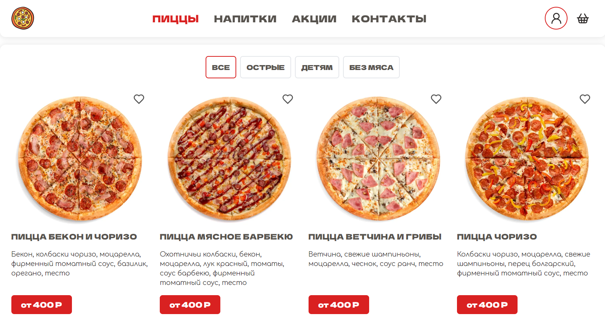
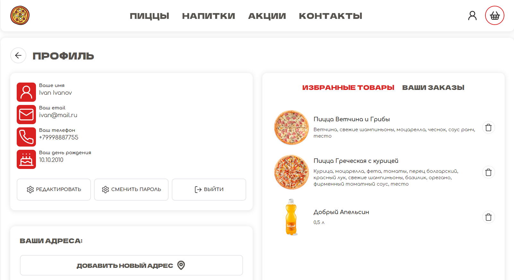

# React Pizza 🍕

## Содержание

- [О проекте](#о-проекте)
- [Установка и запуск](#установка-и-запуск)
- [Технологический стек](#технологический-стек)
- [Возможности](#возможности)
- [Ссылка на проект](#Ссылка-на-проект)

## О проекте

Этот проект представляет собой веб-приложение для заказа пиццы, разработанное с использованием React и развернутое на Vercel.



---



## Установка и запуск

1. **Клонирование репозитория**:

```sh
git clone https://github.com/smolinartem/react-pizza-typescript.git
```

2. **Установка зависимостей:**

```sh
cd react-pizza-typescript
npm install
```

3. **Запуск приложения:**

```sh
npm run dev
```

## Технологический стек:

- React
- Typescript
- React Router
- React Hook Forms
- Zod
- Redux Toolkit
- Tailwind CSS

## Возможности:

- Отображение карточек продуктов из json объекта
- Фильтрация товаров на основе их категории
- Форма для кастомизации пиццы
- Добавление товаров в корзину
- Отображение количества товаров на иконке корзины
- Добавление одинаковых товаров увеличивает количество данного товара в корзине
- Управление количеством товара в корзине
- Регистрация пользователя
- Редактирование профиля и смена пароля
- Добавление и выбор адреса
- Добавление товаров в избранное
- Подтверждение заказа и отображение их в истории заказов

## Ссылка на проект:

- [Проект на Vercel](https://krutopognali-react-pizza.vercel.app/)
